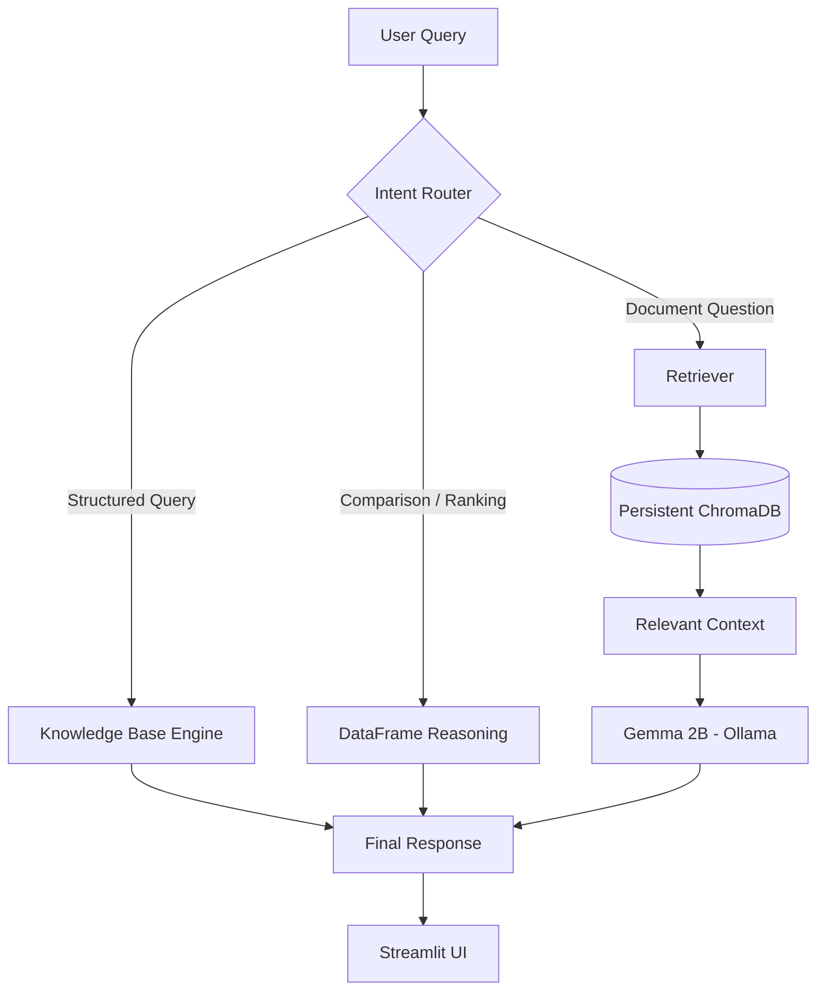
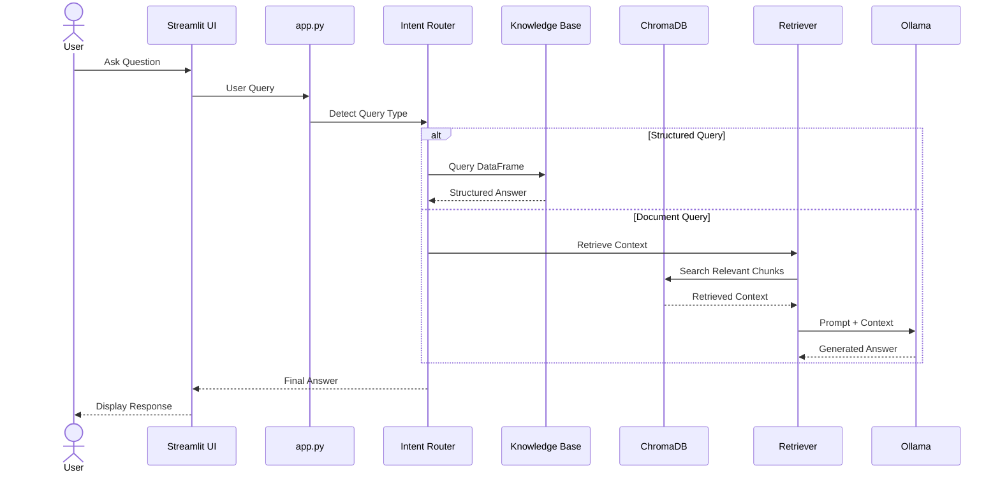
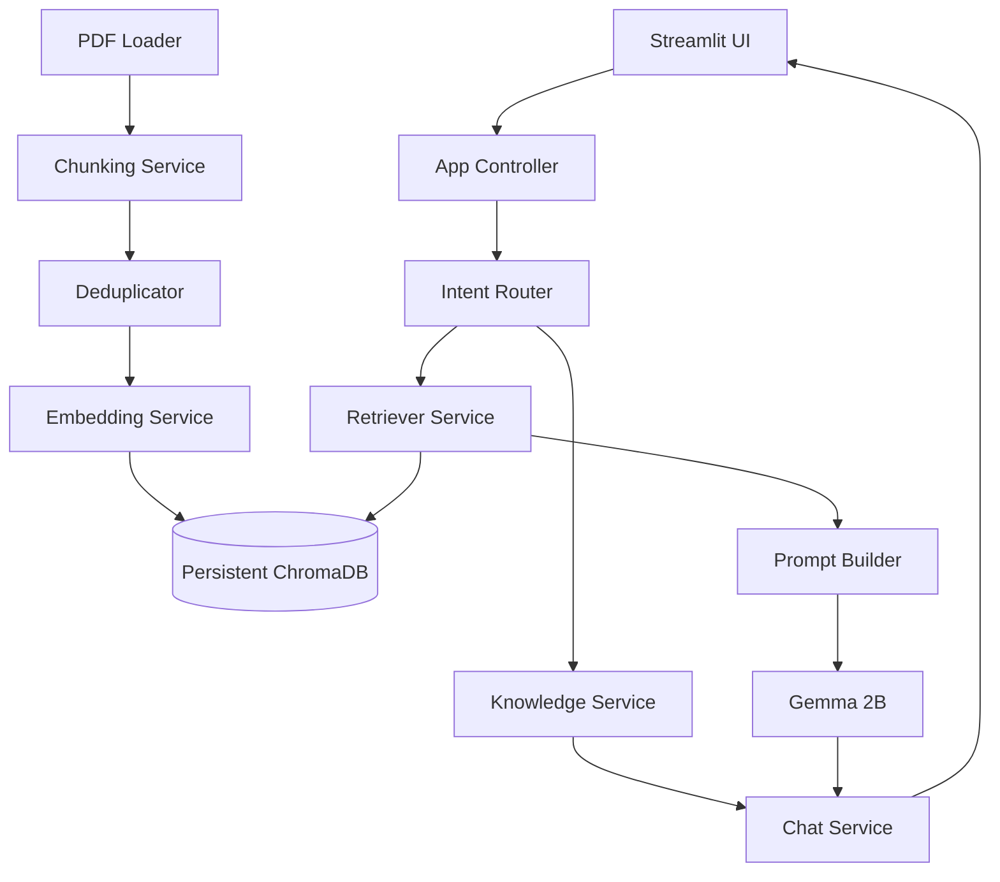
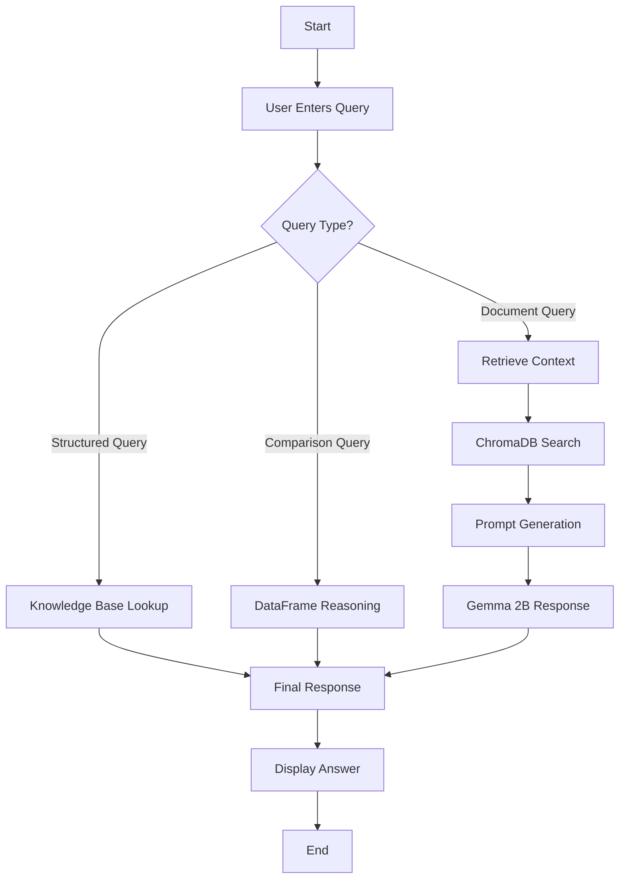

# Placement Intelligence Hybrid RAG System

**An Enterprise-Grade Hybrid RAG System for Placement Intelligence using Local LLMs, Persistent ChromaDB, Structured Knowledge Reasoning, and Modular Software Engineering Practices**

---

# Overview

Placement Intelligence Hybrid RAG System is an enterprise-style placement intelligence assistant designed to answer placement-related queries using a combination of:

* Structured Knowledge Base Reasoning
* Retrieval-Augmented Generation (RAG)
* Persistent Vector Search
* Local LLM Inference

Unlike traditional RAG systems that rely only on vector similarity search, this system combines **structured reasoning over placement company data** with **document retrieval** to improve factual accuracy and reduce hallucinations.

The system intelligently routes queries:

### Structured Queries

Handled through a **Knowledge Base Engine**

Examples:

* What is the package offered by Google?
* Does Microsoft allow backlogs?
* Which technology does Flipkart focus on?

### Comparison Queries

Handled using **DataFrame-based reasoning**

Examples:

* Compare Google and Amazon package
* Compare Google and Microsoft in eligibility and package

### Ranking & Filtering Queries

Handled using **query reasoning logic**

Examples:

* Which company offers highest package?
* Top 3 companies by package
* Which company using Python offers highest package?
* Which companies allow backlogs?

### Document-Based Questions

Handled through **Retrieval-Augmented Generation**

Examples:

* What rounds does TCS conduct?
* What are the interview experiences of Amazon?

### Out-of-Scope Questions

Handled with **graceful fallback**

Examples:

* Who is the CEO of TCS?
* What is Infosys stock price?

---

# Key Features

## Intelligent Placement Assistant

Ask placement-related questions such as:

```text id="aqg0xq"
What is the package offered by Google?

Does Microsoft allow backlogs?

Compare Google and Microsoft package

Which company offers highest package?

Which company using Python offers highest package?

Which companies allow backlogs?

Which company has high package but low CGPA requirement?

What rounds does TCS conduct?
```

---

## Hybrid Query Engine

Supports:

* Direct Lookup Queries
* Multi-hop Reasoning
* Company Comparisons
* Eligibility Filtering
* Ranking & Sorting
* Constraint-Based Search
* Context-Aware Retrieval
* Out-of-Corpus Detection

---

## Hybrid RAG Architecture

The system combines:

```text id="93g67g"
Knowledge Base Reasoning
            +
Persistent ChromaDB Retrieval
            +
Local LLM Generation
```

This ensures:

* Better factual accuracy
* Reduced hallucinations
* Faster responses
* Structured reasoning
* Improved query handling

---

## Local LLM Architecture

Runs completely offline using **Ollama**

### Language Model

```text id="9nyeyr"
gemma:2b
```

### Embedding Model

```text id="c0h1s0"
nomic-embed-text
```

Benefits:

* No API cost
* No cloud dependency
* Privacy preserving
* Offline execution

---

## Persistent Vector Database

Uses **ChromaDB** with persistence.

Benefits:

* Faster query response
* No repeated embedding generation
* Persistent storage across restarts
* Efficient semantic retrieval

---

## Professional Software Engineering Design

This project follows enterprise software engineering principles:

* Modular Architecture
* Separation of Concerns
* Single Responsibility Principle
* Reusable Components
* Layered Design
* Config-Driven Development
* Maintainable Codebase
* Scalable Folder Structure

---

# System Architecture



---

# End-to-End Query Flow



---

# UML Component Diagram



---

# Activity Diagram



---

# Project Structure

```text id="khxzy2"
placement-intelligence-rag/
│── app.py
│── config.py
│── requirements.txt
│── README.md
│── .gitignore
│
├── data/
│     └── Placement_RAG_Dataset_Enhanced.pdf
│
├── chroma_db/
│
├── src/
│   ├── ingestion/
│   │     ├── pdf_loader.py
│   │     └── chunking_service.py
│   │
│   ├── preprocessing/
│   │     └── deduplicator.py
│   │
│   ├── embeddings/
│   │     └── embedding_service.py
│   │
│   ├── vectordb/
│   │     └── chroma_manager.py
│   │
│   ├── retrieval/
│   │     └── retriever_service.py
│   │
│   ├── llm/
│   │     ├── ollama_client.py
│   │     └── prompt_builder.py
│   │
│   ├── rag/
│   │     └── rag_pipeline.py
│   │
│   └── services/
│         ├── knowledge_service.py
│         └── chat_service.py
│
└── assets/
      └── screenshots/
```

---

# Tech Stack

| Technology       | Purpose               |
| ---------------- | --------------------- |
| Python           | Backend Development   |
| Streamlit        | User Interface        |
| Ollama           | Local Model Execution |
| Gemma 2B         | Local LLM             |
| Nomic Embed Text | Embeddings            |
| ChromaDB         | Vector Database       |
| LangChain        | RAG Orchestration     |
| Pandas           | Structured Reasoning  |
| PyMuPDF          | PDF Parsing           |
| PDFPlumber       | Table Extraction      |

---

# Installation

## Clone Repository

```bash id="f38zbi"
git clone https://github.com/your-username/placement-intelligence-rag.git
```

```bash id="nd2g8k"
cd placement-intelligence-rag
```

---

## Create Virtual Environment

```bash id="q2f5m8"
py -3.11 -m venv venv
```

### Activate Environment

```bash id="tkp5mn"
.\venv\Scripts\Activate.ps1
```

---

## Install Dependencies

```bash id="xw8skz"
pip install -r requirements.txt
```

---

## Install Ollama Models

```bash id="4k0r0v"
ollama pull gemma:2b
```

```bash id="j3hfw3"
ollama pull nomic-embed-text
```

---

## Run Application

```bash id="v2b7u1"
streamlit run app.py
```

---

# Example Queries

```text id="3mg54k"
What is the package offered by Google?

Does Microsoft allow backlogs?

Compare Google and Amazon package

Compare Google and Microsoft in eligibility and package

Which company offers highest package?

Top 3 companies by package

Which companies use Python?

Which company has high package but low CGPA requirement?

What rounds does TCS conduct?

Who is the CEO of TCS?
```

---

# Software Engineering Practices Followed

* Modular Architecture
* Separation of Concerns
* Single Responsibility Principle
* Layered Architecture
* Config-Driven Development
* Persistent Storage
* Reusable Components
* Hybrid Query Routing
* Graceful Error Handling
* Maintainable Codebase

---

# Future Improvements

* Multimodal RAG for Charts & Images
* Query Rewriting
* Metadata-Based Filtering
* Reranking Layer
* Chat History Persistence
* Advanced Eligibility Prediction
* Placement Analytics Dashboard

---

## Author

**Placement Intelligence Hybrid RAG System**
Built using Local LLMs, Hybrid RAG, and Modular Software Engineering Practices.
