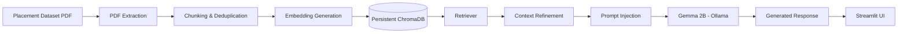
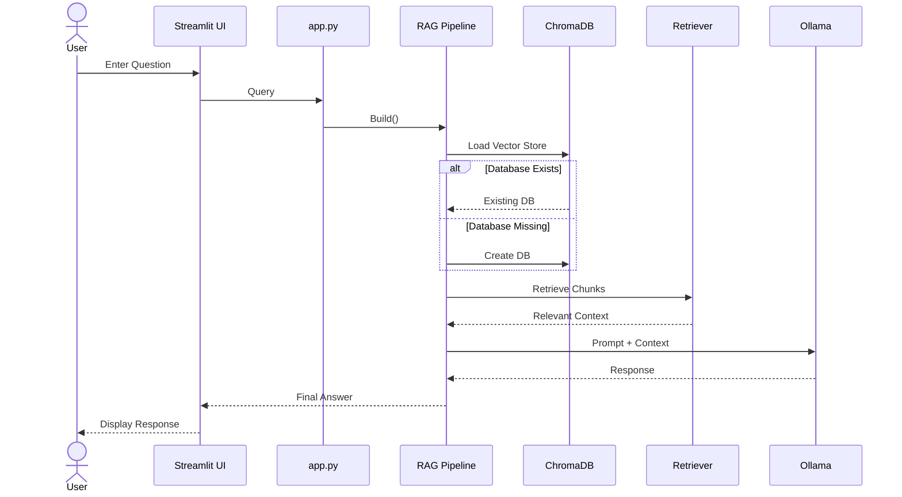
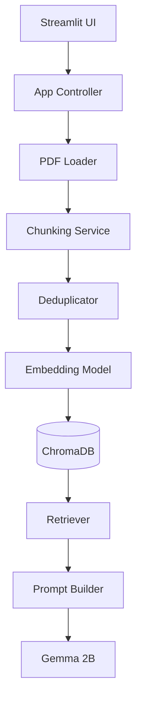
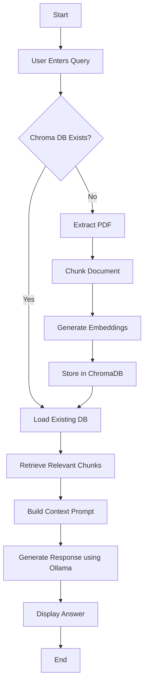

# Placement Intelligence RAG System

**An Enterprise-Grade Retrieval-Augmented Generation (RAG) System for Placement Intelligence using Local LLMs, Persistent ChromaDB, and Modular Software Engineering Practices**

---

## Overview

Placement Intelligence RAG System is an advanced Retrieval-Augmented Generation (RAG) application designed to answer placement-related queries using structured and unstructured placement datasets.

The system processes:

* Company eligibility profiles
* Interview experiences
* Placement statistics
* Hiring distribution data
* Multi-hop reasoning scenarios
* Temporal placement trends
* Conflicting records detection

Unlike traditional chatbots, this system retrieves relevant context from documents before generating responses, reducing hallucinations and improving factual accuracy.

---

## Key Features

### Intelligent Placement Assistant

Ask placement-related questions such as:

* What is the package offered by Google?
* Does Microsoft allow backlogs?
* What rounds does TCS conduct?
* Which company has the highest package?
* Which companies are bond-free?

---

### Advanced RAG Pipeline

Implements a modular retrieval workflow:

```text id="exgpcz"
Rewrite → Retrieve → Rerank → Refine → Insert → Generate
```

---

### Local LLM Architecture

Runs completely offline using **Ollama**.

#### Language Model

```text id="6nj7f8"
gemma:2b
```

#### Embedding Model

```text id="v7b1t0"
nomic-embed-text
```

No cloud dependency.

No API keys.

Privacy preserving.

---

### Persistent Vector Database

Uses **ChromaDB** with persistence.

Benefits:

* Faster query response
* No repeated embedding generation
* Persistent storage across restarts

---

### Professional Software Engineering Design

* Modular Architecture
* Separation of Concerns
* Reusable Components
* Config-Driven Design
* Scalable Project Structure
* Maintainable Codebase

---

## System Architecture



---

## UML Sequence Diagram

### End-to-End Query Processing Flow



---

## Component Diagram



---

## Activity Diagram



---

## Project Structure

```text id="n3l9y7"
placement-intelligence-rag/
│── app.py
│── config.py
│── requirements.txt
│── README.md
│── .gitignore
│
├── data/
│     └── Placement_RAG_Dataset_Enhanced.pdf
│
├── chroma_db/
│
├── src/
│   ├── ingestion/
│   │     ├── pdf_loader.py
│   │     └── chunking.py
│   │
│   ├── preprocessing/
│   │     └── deduplicator.py
│   │
│   ├── embeddings/
│   │     └── embedding_model.py
│   │
│   ├── vectordb/
│   │     └── chroma_manager.py
│   │
│   ├── retrieval/
│   │     └── retriever.py
│   │
│   ├── llm/
│   │     └── ollama_client.py
│   │
│   └── rag/
│         └── pipeline.py
│
└── assets/
      └── screenshots/
```

---

## Tech Stack

| Technology       | Purpose               |
| ---------------- | --------------------- |
| Python           | Backend Development   |
| Streamlit        | User Interface        |
| Ollama           | Local Model Execution |
| Gemma 2B         | LLM                   |
| Nomic Embed Text | Embeddings            |
| ChromaDB         | Vector Database       |
| LangChain        | RAG Orchestration     |
| PyMuPDF          | PDF Parsing           |

---

## Installation

### Clone Repository

```bash id="ztr31m"
git clone https://github.com/your-username/placement-intelligence-rag.git
```

```bash id="dqqm5w"
cd placement-intelligence-rag
```

---

### Create Virtual Environment

```bash id="w0htte"
py -3.11 -m venv venv
```

Activate:

```bash id="vayb20"
.\venv\Scripts\Activate.ps1
```

---

### Install Dependencies

```bash id="qjz29m"
pip install -r requirements.txt
```

---

### Install Ollama Models

```bash id="y0i98n"
ollama pull gemma:2b
```

```bash id="gl1rji"
ollama pull nomic-embed-text
```

---

### Run Application

```bash id="1mjlwm"
streamlit run app.py
```

---

## Example Queries

```text id="8twh1r"
What is the package offered by Google?

Does Microsoft allow backlogs?

What rounds does TCS conduct?

Which companies are bond-free?

Which company has highest package?
```

---

## Software Engineering Practices Followed

* Modular Architecture
* Layered Design
* Single Responsibility Principle
* Reusable Components
* Persistent Storage
* Config-Based Parameters
* Separation of Concerns
* Clean Folder Structure
* Maintainable Codebase

---


